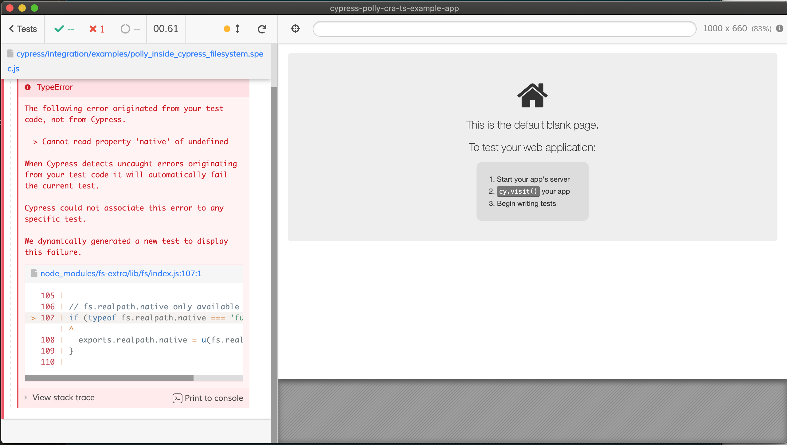

fs.realpath is undefined when running Polly filesystem test inside of Cypress Chrome 85

## Steps to reproduce

```bash
git clone git@github.com:micahstubbs/cypress-polly-cra-ts-example-app.git
yarn
yarn cypress run --headed --no-exit --spec cypress/integration/examples/polly_inside_cypress_filesystem.spec.js
```

Then you should see:



## Error Details

TypeError
The following error originated from your test code, not from Cypress.

> Cannot read property 'native' of undefined

When Cypress detects uncaught errors originating from your test code it will automatically fail the current test.

Cypress could not associate this error to any specific test.

We dynamically generated a new test to display this failure.

Check your console for the stack trace or click this message to see where it originated from.
`node_modules/fs-extra/lib/fs/index.js:107:1`

```js
  105 |
  106 | // fs.realpath.native only available in Node v9.2+
> 107 | if (typeof fs.realpath.native === 'function') {
      | ^
  108 |   exports.realpath.native = u(fs.realpath.native)
  109 | }
  110 |
```

View stack trace

```js
    at Object../node_modules/fs-extra/lib/fs/index.js (webpack:///node_modules/fs-extra/lib/fs/index.js:107:1)
    at __webpack_require__ (webpack:///webpack/bootstrap:19:1)
    at Object../node_modules/fs-extra/lib/index.js (webpack:///node_modules/fs-extra/lib/index.js:6:3)
    at __webpack_require__ (webpack:///webpack/bootstrap:19:1)
    at Module.eval (webpack:///node_modules/@pollyjs/node-server/dist/es/pollyjs-node-server.js:1:1)
    at Module../node_modules/@pollyjs/node-server/dist/es/pollyjs-node-server.js (http://localhost:3000/__cypress/tests?p=cypress/integration/examples/polly_inside_cypress_filesystem.spec.js:69091:31)
    at __webpack_require__ (webpack:///webpack/bootstrap:19:1)
    at Module../node_modules/@pollyjs/persister-fs/dist/es/pollyjs-persister-fs.js (webpack:///node_modules/@pollyjs/persister-fs/dist/es/pollyjs-persister-fs.js:1:1)
    at __webpack_require__ (webpack:///webpack/bootstrap:19:1)
    at Object../cypress/integration/examples/polly_inside_cypress_filesystem.spec.js (webpack:///cypress/integration/examples/polly_inside_cypress_filesystem.spec.js:3:1)
From previous event:
    at Object.runScripts (http://localhost:3000/__cypress/runner/cypress_runner.js:176807:29)
    at $Cypress.onSpecWindow (http://localhost:3000/__cypress/runner/cypress_runner.js:166278:21)
```
